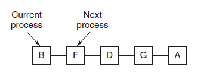

# 操作系统

## 概述

### 基本特征

#### 1. 并发

并发指宏观上一段时间内能同时运行多个程序，并行指同一时刻能运行多个指令。

并行需要硬件支持：多流水线、多处理器。

操作系统引入进程和线程，使程序能够并发运行。

#### 2. 共享

共享指多个进程同时使用系统资源。

两种共享：互斥共享和同时共享。

互斥共享使用的是临界资源，同一时刻只允许一个进程访问，需要用同步机制实现互斥访问。

同步原语：

- 互斥锁
- 信号量
- 条件变量
- 读写锁

#### 3. 虚拟

虚拟技术把一个物理实体转换为多个逻辑实体。

主要有两种虚拟技术：时分复用和空分复用。

多进程在同一个处理器上并发执行使用了时分复用，轮流占用处理器。

虚拟内存使用了空分复用，将物理内存抽象为地址空间，每个进程都有自己的地址空间。

#### 4. 异步

异步指进程不是一次性执行完毕，走走停停。

### 基本功能

#### 1. 进程管理

进程控制、进程同步、进程通信、死锁处理、处理机调度等。

#### 2. 内存管理

内存分配、地址映射、内存保护与共享、虚拟内存等。

#### 3. 文件管理

文件存储空间的管理、目录管理、文件读写管理和保护。

#### 4. 设备管理

完成用户的I/O请求，方便用户使用各种设备，并提高设备的利用率。

主要包括缓冲管理、设备分配、设备处理、虚拟设备等。

### 系统调用

一个进程在用户态要用到内核态的功能，就进行系统调用，从而陷入内核，由操作系统代完成。

Linux 的系统调用主要有以下这些（暂不了解）：

| Task     | Commands                    |
| -------- | --------------------------- |
| 进程控制 | fork(); exit(); wait();     |
| 进程通信 | pipe(); shmget(); mmap();   |
| 文件操作 | open(); read(); write();    |
| 设备操作 | ioctl(); read(); write();   |
| 信息维护 | getpid(); alarm(); sleep(); |
| 安全     | chmod(); umask(); chown();  |

### 宏内核和微内核

#### 1. 宏内核

将操作系统作为紧密结合的整体放到内核。

由于各模块共享信息，所以性能高。

#### 2. 微内核

将一部分操作系统功能移出内核，降低内核复杂性。移出部分根据分层原则划分为若干服务，相互独立。

只有微内核运行在内核态，其它模块运行在用户态。

频繁在用户态和内核态切换，有一定的性能损失。

### 中断分类

#### 1. 外中断

由CPU执行指令以外的事件引起（表示设备输入/输出处理已经完成，处理器能够发送下一个输入/输出请求），如I/O完成中断、始终中断、控制台中断等。

#### 2. 异常

由CPU执行指令的内部事件引起，如非法操作码、地址越界、算术溢出等。

#### 3. 陷入

用户程序使用系统调用。

## 进程管理

### 进程与线程

#### 1. 进程

是资源分配的基本单位。

进程控制块 (Process Control Block, PCB) 描述进程的基本信息和运行状态，所谓的创建进程和撤销进程，都是指对 PCB 的操作。

下图显示了 4 个程序创建了 4 个进程，这 4 个进程可以并发地执行。（时分复用）

#### 2. 线程

是独立调度的基本单位。

一个进程中可以有多个线程，共享进程资源。（互斥共享、同时共享）

浏览器是一个进程，浏览器进程里面有很多线程，例如 HTTP 请求线程、事件响应线程、渲染线程等等，线程的并发执行使得在浏览器中点击一个新链接从而发起 HTTP 请求时，浏览器还可以响应用户的其它事件。

#### 3. 区别

以下是将您的描述转化为表格的形式：

|          | 进程                                                         | 线程                                                         |
| -------- | ------------------------------------------------------------ | ------------------------------------------------------------ |
| 拥有资源 | 进程是资源分配的基本单位，拥有独立的资源                     | 线程不拥有资源，可以访问隶属进程的资源                       |
| 调度     | 进程切换会引起线程切换                                       | 线程是独立调度的基本单位，线程的切换不会引起进程切换（指单个进程中的线程切换） |
| 系统开销 | 创建或撤销进程的开销大，需要分配或回收资源，如内存空间、I/O 设备等 | 创建或撤销线程的开销小，线程切换时只需保存和设置少量寄存器内容 |
| 通信     | 进程间通信需要借助 IPC                                       | 线程间可以通过直接读写同一进程中的数据进行通信               |

### 进程状态的切换

- 就绪（ready）：等待被调度
- 运行（running）
- 阻塞（waiting）：等待资源

注意：

- 只有就绪和运行可以相互转换，其它都是单向。就绪的进程通过调度算法获得CPU时间，转为运行；运行用完分配的CPU时间，转为就绪。
- 阻塞是运行态缺少资源转换而来，这个资源不包括CPU时间。

### 进程调度算法

因地制宜。

#### 1. 批处理系统

没有太多用户操作，目标是保证吞吐量和周转时间。（从**提交**到终止的时间）

##### 1.1 先来先服务 first-come first-served（FCFS）

非抢占式，按请求顺序调度。

不利于短作业，因为要等待前面的长作业执行完毕。

##### 1.2 短作业优先

非抢占，按**估计**运行时间最短调度。

长作业有可能永远得不到调度。

##### 1.3 最短剩余时间有限

短作业优先的抢占式版本，按**剩余**运行时间最短的顺序进行调度。新作业到达时，会与当前进程剩余时间比较。如果新进程需要时间更少，则挂起当前进程，运行新的进程（抢占）。

#### 2. 交互式系统

##### 2.1 时间片轮转

所有就绪进程按FCFS原则排成队列，CPU分配时间，轮转执行进程。

效率和时间片的大小相关：

- 时间片太小，导致进程切换频繁，消耗时间。
- 时间片太大，实时性得不到保证。

##### 2.2 优先级调度

为每个进程分配优先级，按优先级调度。

为防止低优先级进程等不到调度，可随时间推移增加等待进程的优先级。

##### 2.3 多级反馈队列

一个进程需要执行 100 个时间片，如果采用时间片轮转调度算法，那么需要交换 100 次。

多级队列是为这种需要连续执行多个时间片的进程考虑，它设置了多个队列（依然是时间片轮转），每个队列时间片大小都不同，例如 1,2,4,8,..。进程在第一个队列没执行完，就会被移到下一个队列（降低优先级）。这种方式下，之前的进程只需要交换 7 次。

只有上一个队列没有进程在排队，才能调度当前队列上的进程。

#### 3. 实时系统

要求请求在一个确定时间内得到相应。

分为硬实时（必须满足绝对的截止时间）和软实时（可以容忍一定的超时）。

### 进程同步

